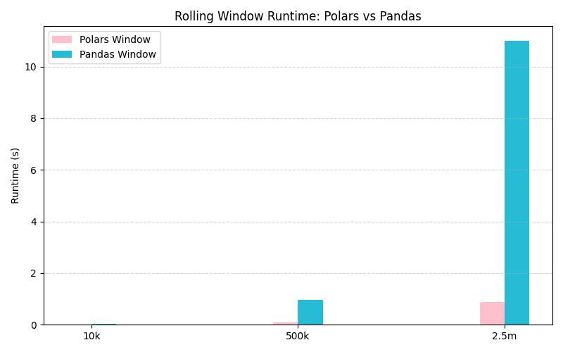
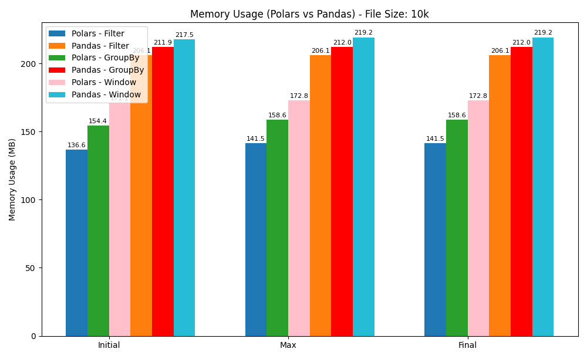
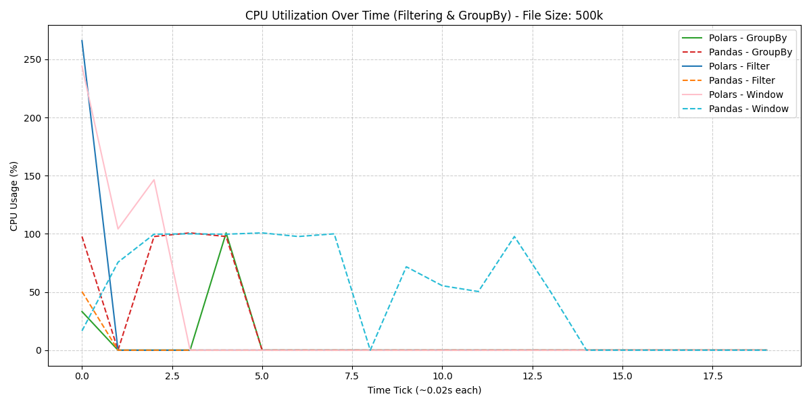

# Polars vs Pandas: Performance and Profiling Comparison

This project compares the performance, functionality, and profiling capabilities of two popular Python data processing libraries: **Polars** and **Pandas**. It provides benchmark analyses, profiling reports, and practical examples using both synthetic and real financial datasets.

---

## 📌 Purpose

The goal of this project is to:

- Evaluate **performance differences** between Polars and Pandas.
- Analyze **profiling reports** using tools like `pandas_profiling` and `polars_profiling`.
- Demonstrate practical **data manipulation methods** using both libraries.
- Provide a reusable framework for others to compare and choose the right tool for their workflow.

---

## 🧠 Project Structure

| File / Folder                | Description |
|-----------------------------|-------------|
| `Methods_Pandas.py`         | Contains functions for loading, transforming, and analyzing data using **Pandas**. |
| `Methods_Polars.py`         | Same functionality as above, but using **Polars**. |
| `Performance.py`            | Benchmarks key operations using Pandas and Polars for comparison. |
| `Pandas_profiling.py`       | Generates an HTML profiling report using `pandas_profiling`. |
| `Polars_profiling.py`       | Generates a profiling report using the experimental `polars_profiling`. |
| `Graphs.py`                 | Visualizes performance metrics and results. |
| `Print.py`                  | Prints summaries, metadata, and operation logs. |
| `metadata/`                 | Stores intermediate outputs, profiling logs, or schema descriptions. |
| `.gitignore`                | Prevents large and unnecessary files (like Parquet and CSVs) from being tracked. |

---

## 📊 Datasets Used 

*Real and synthetic datasets* in `.csv`, `.xlsx`, and `.parquet` formats (excluded from the repo due to size) include:

- Synthetic bank transactions (1–6)
- Merged Parquet files
- Demographic and transactional Excel files

> These files are used for benchmarking and generating profiling reports but are **not included** in this repo due to GitHub’s file size limits.

---

## Results:

As it is shown above, using Rolloing window with Polars is more efficient, where it completed the task 10 times faster than Pandas



Polars used in general less memory to complete the task, across all 3 phases, Initalizing the task to run, completing the task, and reserving a maximum unit of memory.


Polars utilized over 100% of CPU power, indicating that it uses threading to process and complete the tasks, where pandas run on a single process, it took 4 time more time to complete the same task


## 🛠️ Setup Instructions

1. **Clone the repository**

```bash
git clone https://github.com/Yousif-AlEshari/Polars-Pandas-Comparison.git
cd Polars-Pandas-Comparison
```
2. **Install dependencies**
```
python -m venv venv
source venv/bin/activate  # On Windows use: venv\Scripts\activate
pip install pandas polars matplotlib seaborn
```
3. **How to run**
```
python Graphs.py
```

## ⚠️ Notes
Large datasets (CSV/Parquet) are excluded to avoid GitHub size restrictions. Place your own data in the project directory before running the code, and make sure to update the path of the files in "Graphs.py" file.

.gitignore is configured to ignore large or temporary files like .parquet, .csv, and __pycache__/.


## ✅ Requirements
Python 3.8+

pandas

polars

pandas-profiling

matplotlib

seaborn

## 📃 License
This project is open-source and available under the MIT License.

## 👤 Author
Yousif AlEshari


